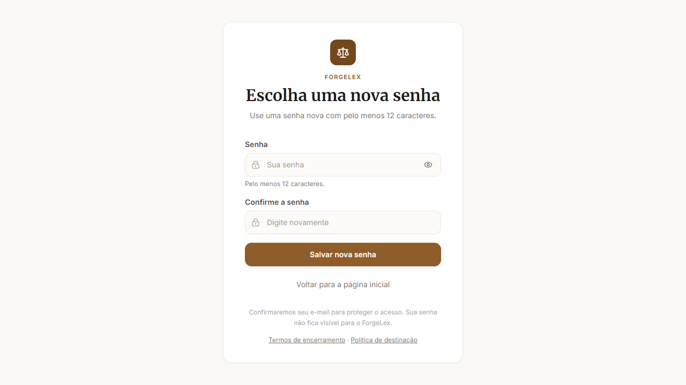
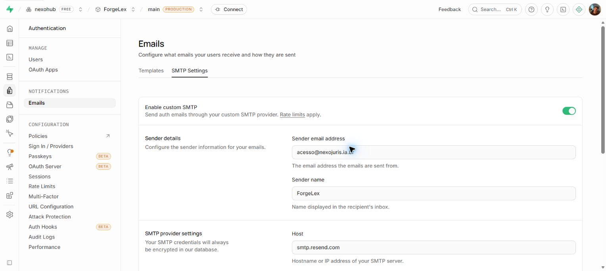

# Fase 6 — publicação controlada e gate de e-mail validados

Data local: 01/10/2026; timestamps dos recibos em UTC, incluindo 02/10/2026. Checkout: `C:\Users\Boni Jr\.antigravity-ide\SDK`. Boni autorizou commit/push e execução da Fase 6, incluindo promoção progressiva, rollback, DNS e integração Resend/Supabase. O recibo inicial preserva a fotografia anterior à configuração SMTP; o adendo abaixo registra o fechamento posterior do gate de e-mail.

## Origem e validação

A primeira promoção usou o digest da Fase 5, `sha256:b12b7be89078765c113ba42cf6e0818cf6243571a85f1ddb206e69302d913b7f`, em `forgelex-api-prod-phase6-d1e22ed3`. As etapas 5%/25%/100% e o retorno à revisão anterior passaram nas sondas e nos smokes autenticados. O teste de recuperação no navegador encontrou dois problemas reais: Site URL do Supabase em `http://localhost:3000` e ponto de entrada público exibindo login em vez do formulário de nova senha. A produção foi devolvida a `forgelex-api-prod-00003-moc` durante a correção.

Site URL salva como `https://nexojuris.ia.br`; verificação de link novo retornou HTTP 303 para esse domínio. `AuthEntry` passou a respeitar recuperação/erro, e `AuthScreen` acompanha o callback assíncrono sem perder a solicitação de outro link. A revisão independente encontrou uma regressão de remontagem antes da correção final; o teste de interação reproduziu a falha e passou após preservar a identidade da rota.

Commit `21392d0`, [PR #17](https://github.com/junior-aguiar-eng/ForgeLex/pull/17), integrada após os seis checks obrigatórios. SHA de origem runtime: **`0268ffcbb5bd0a3f8f6bfd15cb3bdd2875b477fa`**, main limpo e igual ao remoto antes do build. [CI desse SHA](https://github.com/junior-aguiar-eng/ForgeLex/actions/runs/36942924269): seis checks aprovados. Local: **534 testes aprovados e 4 ignorados**, lint/build/typecheck aprovados; E2E público **8/8**. Os skips incluem providers reais e integrações PostgreSQL condicionais locais; o check PostgreSQL remoto passou.

Cloud Build **`7c4fac25-5358-4943-982f-2f68ce70e065`**, `SUCCESS`. Digest **`sha256:e3a31359372134b26a610a2eee6f2c228f7f4fa6951f67a04776a24774cbdf70`**, revisão **`forgelex-api-prod-phase6-0268ffcb`**, Ready. Billing e encerramento habilitados; migrations automáticas, worker e scheduler internos desabilitados, com reconciliação pelo Scheduler existente. Ingress `internal-and-cloud-load-balancing` preservado; nenhum host rule, backend ou endereço A do balanceador alterado.

## Promoção e cadeia pública

A revisão corrigida passou por **5% → 25% → 100%**, com janela mínima de 120 segundos por etapa e sondas marcadas correlacionadas aos logs de revisão. Depois foi demonstrado rollback para `forgelex-api-prod-00003-moc` a 100%, com nova janela e smoke, e retorno à revisão corrigida a 100%. Horários, amostras e revisões observadas constam no [recibo saneado](2026-10-01-phase6-proof.json).

Homepage, rotas diretas, documentos legais, readiness, OpenAPI, bootstrap, login, REST e MCP passaram. Pesquisa sem saldo retornou 402, saldo e eventos de uso preservados. Chave sintética criada e revogada; reutilização retornou 401. Retorno de billing foi carregado no navegador; o ensaio de cancelamento anterior verificou a mensagem, sem compra real. Não há afirmação de cobrança ou webhook financeiro real aprovado.

Recuperação no navegador com link novo: formulário de nova senha visível, atualização concluída e login posterior com a senha nova aprovado. Callback expirado mostrou erro e permitiu solicitar outro link. O cadastro da fixture utilizou link gerado pela administração e confirmação por OTP, **sem envio de e-mail**; isso não comprova o cadastro público com entrega SMTP.

Encerramento solicitado exclusivamente por conta sintética, HTTP 202, com bloqueio imediato de acesso HTTP 401 e consulta de status disponível. Após o primeiro ensaio, o agregado evoluiu de três para quatro encerramentos COMPLETED, com zero erros; essa correlação não equivale à leitura individual do closureId. O segundo encerramento ainda estava ACCESS_BLOCKED na coleta final. A remoção Auth e a rejeição de sessão das fixtures estão registradas separadamente no recibo.

## Observabilidade e limpeza

Foram consultados logs 4xx/5xx, séries de contagem de requests, latência e instâncias, conexões PostgreSQL, webhook, ingestão, encerramento, Scheduler e backups. As séries brutas não sustentam uma afirmação de p95 global ou de estabilidade prolongada. Respostas 401/402 dos ensaios são esperadas; nenhum 5xx foi encontrado na janela indicada no recibo. Agregados e horário do backup são específicos da coleta.

A ingestão STJ do dia estava concluída; existe uma falha histórica anterior, preservada no agregado. Webhook sem registros não prova processamento de pagamento real. Nenhuma migration remota foi executada nesta fase.

Nenhum secret temporário foi criado. Conta Auth sintética removida, leitura administrativa 404, sessão rejeitada com 401; chaves revogadas antes da limpeza. Job temporário de observabilidade removido. A subnet `forgelex-phase5-smoke`, pendente no recibo histórico da Fase 5, foi excluída após liberação da reserva gerenciada; ausência confirmada. Recursos permanentes de produção e homologação preservados.

## Gate de e-mail

Resend Free conectado via GitHub pelo usuário, domínio **`nexojuris.ia.br` verificado**, região São Paulo. Com autorização específica foram adicionados os registros TXT `resend._domainkey` e CNAMEs `rsend`/`send`; resolução pública conferida. Recebimento de e-mail não foi ativado; remetente **`ForgeLex <acesso@nexojuris.ia.br>`**.

A integração automática recebeu autorização específica para **Auth e Projects READ + WRITE na organização nexohub inteira**. Foi vinculada exclusivamente ao projeto produtivo `mmywgqttfthtwntjkqgh` (ForgeLex). A chave permanente `Supabase Integration` foi provisionada pelo assistente do Resend, sem copiar sua credencial para chat, arquivos ou Git. SMTP habilitado com `smtp.resend.com:465`, usuário `resend`, intervalo mínimo de 60 segundos por usuário; configuração persistida conferida após reabrir o painel.

Recuperação solicitada pela interface pública ao endereço controlado por Boni: mensagem `Reset your password` marcada **Delivered** no Resend. Cadastro de alias sintético dessa mesma caixa realizado pelo método público `signUp`, com os mesmos argumentos da aplicação, sem link administrativo nem confirmação injetada: mensagem `Confirm your email address` marcada **Delivered**. Boni informou que clicou; Auth registrou confirmação em **02/10/2026 00:46:34 UTC**, seguida de login com a senha original do cadastro, bootstrap 200 e sessão 200. O clique e o timestamp confirmam a cadeia desse cadastro; Delivered isoladamente não demonstra leitura, caixa de entrada ou entrega universal. A senha da conta original de Boni não foi alterada.

O helper interrompeu a consulta de saldo por usar uma rota inexistente (404). A continuação verificou `/api/v2/billing/account`, saldo zero. Uma tentativa de encerramento com sessão magiclink administrativa retornou 409; após rotação em memória da senha exclusivamente sintética e login por senha, o encerramento retornou 202/ACCESS_BLOCKED e acesso 401. A sessão administrativa foi usada apenas na limpeza, depois da confirmação real do e-mail. Auth sintético removido, consulta administrativa 404 e sessão original rejeitada com 401 às 00:53:09 UTC. Esses incidentes do helper e os recibos finais foram preservados no [adendo saneado](2026-10-01-phase6-smtp-proof.json). Não se afirma reconciliação final COMPLETED dessa última conta.

**Fase 6 concluída:** publicação a 100%, rollback e cadeia de cadastro/e-mail comprovados no escopo acima. A integração SMTP é configuração externa; a origem da imagem continua `0268ffcbb5bd0a3f8f6bfd15cb3bdd2875b477fa`. QA humano, ChatGPT real, cinco usuários e auditoria WCAG permanecem na Fase 7.
