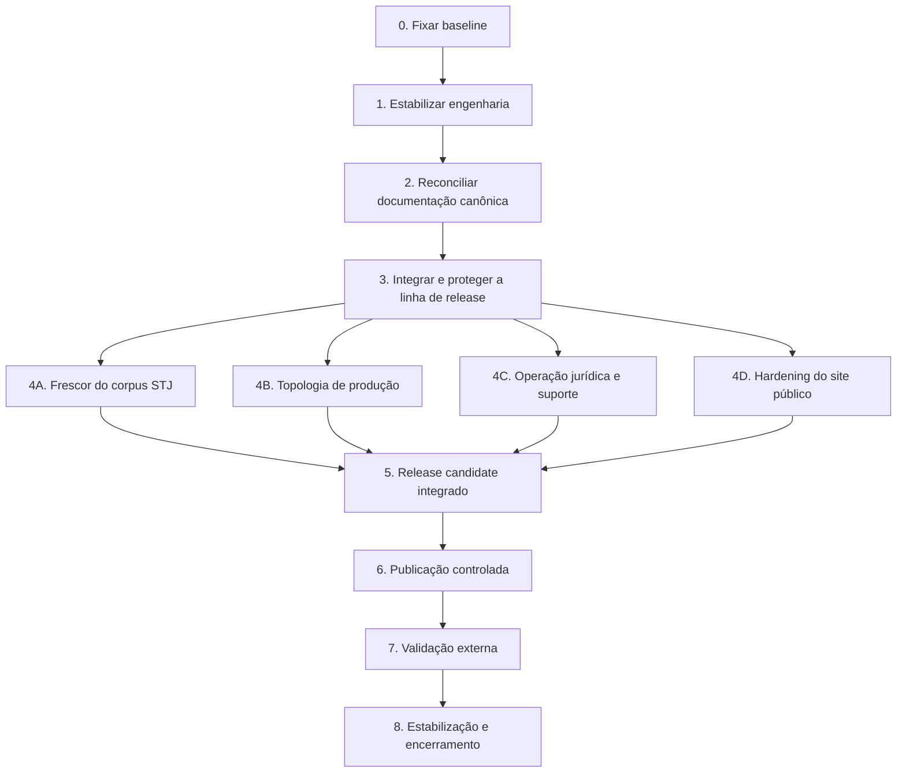

# Plano de implementação da estabilização pós-auditoria do ForgeLex

> **For agentic workers:** REQUIRED SUB-SKILL: Use superpowers:subagent-driven-development (recommended) or superpowers:executing-plans to implement this plan task-by-task. Steps use checkbox (`- [ ]`) syntax for tracking.

**Goal:** Consolidar o ForgeLex/STJ em uma linha de release reproduzível, corrigir os riscos encontrados na auditoria de 25/09/2026 e publicar o site público somente depois de estabilizar engenharia, dados, operação e documentação.

**Architecture:** Este é um plano-programa subordinado ao plano progressivo já concluído para o produto STJ. Ele não reabre as Fases 0–8 e 14, não descongela as Fases 9–13 e não substitui o prompt mestre do frontend. As Fases 0–3 deste plano formam a fundação sequencial obrigatória; depois delas, quatro trilhas independentes podem avançar em paralelo, mas todas convergem antes da publicação pública.

**Tech Stack:** TypeScript, React 18, Vite, Fastify, Vitest, Playwright, PostgreSQL, Supabase Auth, Google Cloud Run, Cloud SQL, Cloud Scheduler, Cloud Storage, GitHub Actions e pnpm 11.

**Spec:** `Plano de conclusão progressiva do F.md`; `STATUS_VALIDACAO.md`; `docs/operations/phase8/final-validation.md`; `docs/operations/phase14/controlled-charge-evidence.md`; `docs/operations/account-closure/validation.md`; `docs/superpowers/plans/2026-09-21-melhorias-experiencia-produto-forgelex.md`; e o prompt mestre canônico versionado `docs/product/frontend-master-prompt.md` (origem registrada em `docs/README.md`).

## Global Constraints

- O STJ permanece como único tribunal comercialmente pesquisável.
- STF, TST, TJSP, TJRJ e TRF3 permanecem `FROZEN_STRATEGICALLY` e não integram este plano.
- O ForgeLex cobra somente operações jurídicas próprias; não fornece modelo e não cobra tokens.
- O prompt mestre existente continua sendo a referência canônica do frontend; este plano organiza execução e estabilização, sem reescrevê-lo.
- Nenhuma fixture, saldo, usuário, processo, métrica, conexão ou resultado sintético pode aparecer como dado real em produção.
- Segredos de servidor não entram no bundle do frontend, no Git, em logs ou em evidências.
- Commit, push, merge, branch protection, migration, alteração de Cloud, deploy, tráfego, cobrança e teste destrutivo real permanecem gates independentes.
- Cada fase deve terminar com working tree limpo, evidência datada, SHA, ambiente e comandos executados.
- Uma fase não pode usar como prova um resultado produzido antes do seu SHA final.
- Gates remotos devem usar contas, tenants e chaves sintéticos, salvo autorização explícita diferente.

## Review Focus

1. **Release divergente:** o código publicado existe na branch de feature, mas não em `main`; a Fase 3 deve provar ancestralidade, checks e artefato.
2. **Testes sensíveis a paralelismo:** dois testes excederam cinco segundos no runner padrão e passaram isolados; a Fase 1 deve provar estabilidade repetida, não apenas uma execução verde.
3. **Corpus sem frescor demonstrado:** há ingestão manual, mas não job periódico comprovado; a Trilha A deve falhar de forma observável quando o corpus estiver atrasado.
4. **Homologação servindo o domínio principal:** os dois domínios compartilham serviço, Supabase e Cloud SQL; a Trilha B deve fixar uma decisão explícita antes de novo deploy.
5. **Encerramento publicado com operação contínua:** a prova pontual não garante prazos futuros; a Trilha C deve fixar responsáveis, alertas e procedimento de atendimento.

## Baseline auditável

- Branch inicial: `feat/incremento-7-1-encerramento` em `6850290`.
- `main` observado: `4f9bdce`, vinte commits atrás da branch.
- Artefato público observado: imagem `closure-release-f10e13f`, revisão `forgelex-api-hml-00021-max`.
- Commit `6850290`: sem PR e sem checks do GitHub.
- `pnpm typecheck`: aprovado.
- `pnpm test`: dois timeouts de cinco segundos no Vitest com paralelismo padrão.
- Testes focados afetados: 9/9 aprovados.
- `pnpm exec vitest run --maxWorkers=4`: 495 aprovados e 4 ignorados.
- `pnpm audit --prod`: uma vulnerabilidade moderada em `uuid@9.0.1`, transitiva por `gaxios`/`@google-cloud/storage`.
- Serviço público e `readyz`: HTTP 200; Scheduler de encerramento habilitado; backups automáticos recentes concluídos.
- Único Cloud Scheduler encontrado: reconciliação de encerramento; nenhum job remoto de ingestão STJ foi comprovado.

## Dependências entre fases

As Trilhas 4A–4D não dependem umas das outras para implementação. A falha de uma não bloqueia o avanço técnico das demais, mas bloqueia a formação do release candidate da Fase 5.

---

## Fase 0 — Fixar baseline e fronteiras

**Resultado:** uma fotografia única e reproduzível do que está em Git, no GitHub e no ambiente remoto, sem alterar código ou infraestrutura.

**Files:**

- Modify: `STATUS_VALIDACAO.md`
- Create: `docs/operations/stabilization/2026-09-25-baseline.md`

**Interfaces:**

- Consumes: estado Git, GitHub Actions, revisões Cloud Run, Cloud Scheduler, Cloud SQL e documentos canônicos.
- Produces: matriz `componente → SHA/revisão → ambiente → evidência → próximo gate` usada por todas as fases.

- [ ] **Step 1: registrar Git e GitHub**

Registrar branch, `HEAD`, `origin/main`, contagem `main...HEAD`, PRs, checks e proteção de `main`.

Run: `git status --short --branch && git rev-list --left-right --count origin/main...HEAD && gh pr status`

Expected: working tree limpo, divergência quantificada e ausência/presença de PR declarada sem inferência.

- [ ] **Step 2: registrar o runtime remoto sem segredos**

Registrar nomes de serviço, revisões prontas, imagem, tráfego, Scheduler, estado do Cloud SQL e inventário de backups.

Expected: nenhuma variável secreta, payload jurídico, e-mail ou token na evidência.

- [ ] **Step 3: reconciliar escopo**

Marcar explicitamente:

- Fases 0–8 e 14: concluídas no escopo STJ;
- Fases 9–13: congeladas, fora do plano;
- frontend público, release e operação contínua: escopo deste plano;
- Claude real, novos tribunais e redesign: fora do plano.

- [ ] **Step 4: validar o baseline documental**

Run: `pnpm exec prettier --check STATUS_VALIDACAO.md docs/operations/stabilization/2026-09-25-baseline.md && git diff --check`

Expected: PASS.

**Gate de saída:** toda afirmação posterior consegue apontar para um SHA ou revisão do baseline; nenhuma mutação remota ocorreu.

---

## Fase 1 — Estabilizar os gates de engenharia e segurança

**Resultado:** o comando canônico de testes é determinístico, a vulnerabilidade moderada foi removida e o CI conhece todas as suítes que protegem a release.

### Task 1.1: estabilizar Vitest

**Files:**

- Modify: `vitest.config.ts`
- Modify: `package.json`
- Test: `apps/api/src/static-web.test.ts`
- Test: `packages/persistence/src/repositories/webhook-repository.test.ts`

**Interfaces:**

- Consumes: baseline de 495 testes aprovados com quatro workers.
- Produces: `pnpm test` com limite explícito e reproduzível de workers.

- [ ] **Step 1: criar o teste de configuração do runner**

Adicionar teste que importe a configuração e confirme o limite definido para execução local e CI.

- [ ] **Step 2: provar a condição anterior**

Run: `pnpm test`

Expected before fix: execução pode exceder o timeout em testes de filesystem/SQLite sob paralelismo irrestrito; registrar a ocorrência, sem aceitar flake como sucesso.

- [ ] **Step 3: fixar o paralelismo**

Definir no `vitest.config.ts` um limite explícito de workers, preservando os timeouts funcionais atuais. O baseline de quatro workers passou três vezes, mas uma execução posterior teve saída inesperada de fork no Windows; a implementação final usa dois workers e registra a correção na evidência da Fase 2. Não aumentar globalmente o timeout para esconder contenção.

- [ ] **Step 4: repetir o gate**

Run: `pnpm test` três vezes em processos separados.

Expected: três execuções PASS, com 495 testes aprovados e quatro ignorados ou contagem superior decorrente de novos testes.

### Task 1.2: remover a vulnerabilidade transitiva

**Files:**

- Modify: `apps/api/package.json`
- Modify: `pnpm-lock.yaml`
- Test: `apps/api/src/account/account-closure-journal-gcs.test.ts`

**Interfaces:**

- Consumes: `@google-cloud/storage` e diário GCS existentes.
- Produces: árvore sem versão vulnerável de `uuid` e sem regressão no diário.

- [ ] **Step 1: capturar a árvore vulnerável**

Run: `pnpm why uuid && pnpm audit --prod --audit-level moderate`

Expected before fix: `uuid@9.0.1` e advisory `GHSA-w5hq-g745-h8pq`.

- [ ] **Step 2: atualizar a dependência de origem**

Preferir versão compatível de `@google-cloud/storage`/`gaxios` que resolva `uuid >= 11.1.1`. Usar override somente se a cadeia oficial ainda não tiver release compatível; documentar o motivo no lockfile/commit, sem adicionar pacote direto desnecessário.

- [ ] **Step 3: validar segurança e comportamento**

Run: `pnpm audit --prod --audit-level moderate`

Expected: zero advisories de severidade moderada ou superior relacionados à alteração.

Run: `pnpm exec vitest run apps/api/src/account/account-closure-journal-gcs.test.ts apps/api/src/account/account-closure-journal.test.ts`

Expected: PASS.

### Task 1.3: ampliar o CI proporcionalmente ao risco

**Files:**

- Modify: `.github/workflows/ci.yml`
- Modify: `package.json`
- Modify: `playwright.public.config.ts`
- Verify: `playwright.account-closure.config.ts`
- Verify: `playwright.config.ts`

**Interfaces:**

- Consumes: scripts E2E existentes.
- Produces: checks nomeados para unitários, PostgreSQL, site público, produto autenticado e encerramento.

- [ ] **Step 1: adicionar scripts canônicos ausentes**

Adicionar `test:e2e:public` para `playwright.public.config.ts` e `test:e2e:mcp-onboarding` para a spec existente, sem duplicar comandos no YAML.

- [ ] **Step 2: separar jobs por dependência**

- `validate`: install, lint, typecheck, build e Vitest;
- `postgres`: migration e smoke PostgreSQL;
- `e2e-product`: Phase 7 e onboarding MCP;
- `e2e-public`: site público sem banco;
- `e2e-account-closure`: fixture descartável, sem Supabase real;
- `security`: `pnpm audit --prod --audit-level moderate`.

- [ ] **Step 3: impedir tripla compilação sem reduzir cobertura**

Reutilizar artefatos ou chamar diretamente Vitest depois de build/typecheck no job, mantendo os comandos locais canônicos intactos.

- [ ] **Step 4: validar o workflow localmente**

Run: `pnpm lint && pnpm typecheck && pnpm test && pnpm test:e2e:public && pnpm test:e2e:phase7 && pnpm test:e2e:mcp-onboarding && pnpm test:e2e:account-closure`

Expected: todos PASS com serviços exclusivamente locais/sintéticos.

**Gate de saída da Fase 1:** três execuções estáveis do gate unitário; auditoria sem a vulnerabilidade identificada; todas as suítes críticas representadas no CI.

---

## Fase 2 — Reconciliar a documentação canônica

**Resultado:** código, README, status, plano progressivo e prompt mestre dizem a mesma coisa sobre produto, frontend e ambiente remoto.

**Files:**

- Modify: `README.md`
- Modify: `STATUS_VALIDACAO.md`
- Modify: `docs/README.md`
- Modify: `docs/superpowers/plans/2026-09-21-melhorias-experiencia-produto-forgelex.md`
- Create: `docs/product/frontend-master-prompt.md`
- Modify: `apps/web/index.html`

**Interfaces:**

- Consumes: baseline da Fase 0 e gates da Fase 1.
- Produces: fonte versionada para revisão e release da Fase 3.

- [ ] **Step 1: versionar o prompt mestre existente**

Copiar fielmente o prompt aprovado para `docs/product/frontend-master-prompt.md`, preservando a frase “Do caso à minuta, conecte fatos, provas e jurisprudência.” e registrando a origem. A partir desse commit, a cópia versionada passa a ser o próprio prompt mestre canônico; o arquivo externo permanece apenas como artefato de origem. Não condensar, reinterpretar nem criar outro prompt.

- [ ] **Step 2: corrigir o estado institucional**

No README e no status:

- remover o slogan rejeitado;
- registrar que encerramento foi publicado e habilitado;
- registrar que o site público está implementado na branch, ainda não publicado;
- distinguir produto STJ concluído, release pendente e operação contínua;
- manter outros tribunais congelados.

- [ ] **Step 3: atualizar o estado do plano de experiência**

Preservar o histórico, mas fazer o cabeçalho e a seção final distinguirem implementação local concluída, gates externos pendentes e ativação remota já executada para encerramento.

- [ ] **Step 4: criar teste editorial focal**

Adicionar teste que falhe se o slogan rejeitado reaparecer em `README.md`, `apps/web/index.html` ou no site público, e que confirme a frase aprovada.

- [ ] **Step 5: validar links e formatação**

Run: `pnpm exec prettier --check README.md STATUS_VALIDACAO.md docs/README.md docs/product/frontend-master-prompt.md docs/superpowers/plans/2026-09-21-melhorias-experiencia-produto-forgelex.md && git diff --check`

Expected: PASS, sem link local quebrado para os documentos canônicos.

**Gate de saída:** uma pessoa consegue identificar, a partir de `README.md`, qual código está em produção, o que está apenas implementado e quais gates permanecem.

---

## Fase 3 — Integrar e proteger a linha de release

**Resultado:** `main` contém o código efetivamente publicado e o novo site, com CI verde e política de integração explícita.

**External operations:** criação/merge de PR e branch protection exigem autorização própria no momento da execução.

- [ ] **Step 1: atualizar a branch contra `origin/main`**

Run: `git fetch origin && git merge-base --is-ancestor origin/main HEAD`

Expected: exit 0; se não, rebase/merge deve ser tratado como tarefa própria, sem force push implícito.

- [ ] **Step 2: revisar o diff final**

Run: `git diff --stat origin/main...HEAD && git diff --check origin/main...HEAD`

Expected: apenas encerramento, experiência, site público, testes, documentação e tooling associados.

- [ ] **Step 3: abrir PR única de consolidação**

O título deve refletir a mudança dominante. A descrição deve separar: encerramento publicado, experiência autenticada, site público, CI/segurança e documentação.

- [ ] **Step 4: exigir checks antes do merge**

Todos os jobs da Fase 1 devem concluir com sucesso no SHA final da PR. Resultado anterior de `main` não é válido.

- [ ] **Step 5: configurar proteção de `main`**

Exigir PR, branch atualizada, checks críticos e bloqueio de force push/deletion. Manter secret scanning e push protection já habilitados.

- [ ] **Step 6: merge e reconciliação**

Após autorização, confirmar:

Run: `git rev-parse origin/main && git merge-base --is-ancestor f10e13f origin/main`

Expected: o código do artefato atualmente publicado é ancestral de `main`, e o SHA do site público também está integrado.

**Gate de saída:** nenhum código publicado existe apenas em branch lateral; `main` protegido e verde torna-se a única fonte de release.

---

## Fase 4A — Automatizar frescor e reconciliação do corpus STJ

**Resultado:** ingestão incremental periódica, idempotente, observável e separada do tráfego da API.

**Files:**

- Modify: `scripts/ingest-stj-open-data.mjs`
- Create: `scripts/report-stj-freshness.mjs`
- Create: `scripts/report-stj-freshness.test.ts`
- Create: `ops/gcp/stj-ingestion/Dockerfile`
- Create: `ops/gcp/stj-ingestion/cloudbuild.yaml`
- Create: `ops/gcp/stj-ingestion/README.md`
- Modify: `.env.example`

**Interfaces:**

- Consumes: manifestos e serviço de ingestão existentes, Cloud SQL e fonte oficial STJ.
- Produces: relatório saneado `{lastSuccessfulManifestAt, pending, failed, terminalGaps, lagHours}` e job idempotente.

- [ ] **Step 1: testar cálculo de frescor**

Cobrir corpus atual, ausência de execução, execução em andamento, falha transitória e lacuna terminal oficial que não deve manter alerta infinito.

- [ ] **Step 2: implementar relatório read-only**

O script não deve baixar fonte, alterar manifesto ou expor conteúdo jurisprudencial; deve sair com código não zero quando `lagHours` ultrapassar o limite configurado.

- [ ] **Step 3: empacotar ingestão como Cloud Run Job**

Usar imagem dedicada sem servidor HTTP, secrets somente por referência e service account com acesso mínimo ao Cloud SQL e à rede necessária.

- [ ] **Step 4: validar em homologação manualmente**

Executar duas vezes: a primeira processa somente recursos novos; a segunda prova idempotência sem novas versões indevidas.

- [ ] **Step 5: agendar somente após o ensaio**

Criar Scheduler para o job com frequência inicial conservadora diária. Falha do job deve gerar alerta; sobreposição deve ser impedida.

- [ ] **Step 6: publicar a evidência de cobertura**

Atualizar `docs/jurisprudencia/stj-historical-source.md` apenas com contagens e datas efetivamente observadas.

**Gate de saída:** duas execuções idempotentes, alerta de atraso testado e data de última atualização disponível sem revelar payload.

---

## Fase 4B — Definir topologia de produção e promoção

**Resultado:** decisão explícita sobre isolamento entre `nexojuris.ia.br` e `hml.nexojuris.ia.br`, seguida de uma promoção reproduzível.

**Files:**

- Create: `docs/operations/production/topology-decision.md`
- Create or Modify: `ops/gcp/production/README.md`
- Create or Modify: `ops/gcp/production/*.yaml`
- Modify: `Dockerfile`

**Interfaces:**

- Consumes: `main` integrado e serviços HML existentes.
- Produces: autoridade de produção identificável por projeto, região, serviço, banco, Supabase, domínio e digest.

- [ ] **Step 1: decidir entre promoção e isolamento**

Comparar:

- promover formalmente o stack atual, renomeando classificação e proibindo ensaios destrutivos nele; ou
- criar stack produtivo isolado e preservar HML.

Recomendação: isolamento, porque contas reais, billing e encerramento já compartilham o ambiente de homologação.

- [ ] **Step 2: fixar inventário e custos**

Registrar recursos, service accounts, secrets, banco, storage, Scheduler, DNS, certificados, orçamento e política de escala antes de provisionar.

- [ ] **Step 3: construir por SHA imutável**

Imagem deve ser tagueada por SHA de `main` e registrada por digest. `latest` ou tag editorial isolada não pode ser a identidade de release.

- [ ] **Step 4: validar configuração do frontend no build**

Confirmar `VITE_SUPABASE_URL` e `VITE_SUPABASE_PUBLISHABLE_KEY` no artefato sem imprimir valores; impedir qualquer `service_role`/secret no bundle.

- [ ] **Step 5: executar ensaio de promoção e rollback**

Validar revisão sem tráfego, `readyz`, banco, auth, billing desabilitado para a conta de ensaio, REST, MCP e retorno à revisão anterior.

**Gate de saída:** ambiente escolhido documentado, rollback comprovado e nenhuma ambiguidade entre HML e produção.

---

## Fase 4C — Fechar operação jurídica, privacidade e suporte

**Resultado:** documentos gerais de uso e privacidade, matriz de retenção qualificada e atendimento executável sem improviso.

**Files:**

- Modify: `docs/legal/account-closure-retention-policy.md`
- Create: `docs/legal/terms-of-use.md`
- Create: `docs/legal/privacy-policy.md`
- Create: `docs/operations/support/identity-verification.md`
- Modify: `docs/operations/account-closure/runbook.md`
- Create: `apps/web/public/legal/termos-de-uso.html`
- Create: `apps/web/public/legal/privacidade.html`

**Interfaces:**

- Consumes: categorias de dados e prazos já implementados.
- Produces: copy pública aprovada e responsabilidades operacionais nominais.

- [ ] **Step 1: resolver campos provisórios da matriz**

Cada “a validar”, “a qualificar”, “provisório” ou “a designar” deve ser substituído por decisão documentada ou por bloqueio explícito de publicação daquela categoria.

- [ ] **Step 2: redigir Termos e Privacidade gerais**

Cobrir produto STJ, créditos, pesquisa faturável inclusive sem resultados, papel do host de IA, revisão humana, conta, suporte, encerramento e limites de cobertura.

- [ ] **Step 3: formalizar verificação de identidade**

Definir evidências aceitas, segregação de funções, registro mínimo, canal, recusa, escalonamento e proibição de solicitar `statusToken`.

- [ ] **Step 4: realizar revisões humanas registradas**

Separar revisão jurídica, fiscal/contábil, privacidade e segurança; registrar nome, data, versão e decisão sem transformar autoaprovação técnica em parecer profissional inexistente.

- [ ] **Step 5: testar páginas legais**

Adicionar teste estático de links, headings, versão, contato e ausência de placeholders internos.

**Gate de saída:** nenhum placeholder jurídico interno permanece em documento publicado; suporte consegue tratar um `closureId` sem solicitar segredo.

---

## Fase 4D — Hardening do site público e da navegação

**Resultado:** site público pronto para indexação, compartilhamento, rotas diretas e deploy na topologia escolhida.

**Files:**

- Split: `apps/web/src/public/PublicSite.tsx`
- Create: `apps/web/src/public/PublicHeader.tsx`
- Create: `apps/web/src/public/PublicFooter.tsx`
- Create: `apps/web/src/public/pages/*.tsx`
- Modify: `apps/web/index.html`
- Create: `apps/web/public/robots.txt`
- Create: `apps/web/public/sitemap.xml`
- Modify: `apps/web/src/public/PublicSite.test.ts`
- Modify: `tests/e2e/public-site.spec.ts`
- Modify: `apps/api/src/static-web.test.ts`

**Interfaces:**

- Consumes: prompt mestre versionado, URLs da Trilha B e documentos da Trilha C.
- Produces: páginas públicas modulares, metadados e links legais finais.

- [ ] **Step 1: preservar comportamento com testes antes do split**

Fixar headings, CTAs, dez FAQs, rotas, aliases autenticados, retorno de billing, recuperação de senha e menu com foco contido.

- [ ] **Step 2: dividir o arquivo público por responsabilidade**

Extrair cabeçalho, rodapé e páginas sem alterar copy aprovada ou design tokens. Não criar novo design system.

- [ ] **Step 3: adicionar metadados públicos**

Adicionar canonical, Open Graph e Twitter globais no HTML e title/description por rota no cliente. URLs devem derivar da origem canônica definida pela Trilha B. Não introduzir SSR ou prerender nesta fase; cartões sociais específicos por rota permanecem melhoria futura se houver necessidade demonstrada.

- [ ] **Step 4: publicar robots e sitemap**

Indexar apenas rotas públicas; excluir `/app`, autenticação, conta e callbacks.

- [ ] **Step 5: ligar Termos e Privacidade**

Mostrar links somente depois da aprovação da Trilha C; manter documentos de encerramento como documentos específicos.

- [ ] **Step 6: validar acessibilidade e responsividade automatizadas**

Executar 375×812, 768×1024, 1366×768 e 1440×900; testar teclado, Escape, ciclo de Tab, landmarks, heading único e ausência de overflow.

- [ ] **Step 7: validar build servido pelo Fastify**

Testar assets, fallback SPA, rotas técnicas não capturadas e páginas legais estáticas.

**Gate de saída:** E2E público verde, links válidos, rotas privadas fora do sitemap e bundle sem segredo.

---

## Fase 5 — Formar o release candidate integrado

**Resultado:** um único SHA de `main` reúne engenharia, documentação e as quatro trilhas, sem ainda receber tráfego público.

- [ ] **Step 1: integrar as Trilhas 4A–4D por PRs independentes**

Cada PR deve ter seu próprio gate; não agrupar ingestão, infraestrutura, jurídico e UI em um diff inseparável.

- [ ] **Step 2: executar matriz completa no SHA final**

Run: `pnpm lint && pnpm typecheck && pnpm test && pnpm test:postgres && pnpm test:e2e:public && pnpm test:e2e:phase7 && pnpm test:e2e:mcp-onboarding && pnpm test:e2e:account-closure && pnpm audit --prod --audit-level moderate && git diff --check`

Expected: todos PASS; skips condicionais descritos e sem ocultar teste obrigatório.

- [ ] **Step 3: construir a imagem por SHA**

Registrar build ID, digest, SBOM quando disponível, tamanho e origem do commit.

- [ ] **Step 4: implantar revisão sem tráfego**

Validar `health`, `readyz`, OpenAPI, páginas públicas, auth, REST, MCP, billing bloqueado para tenant sem saldo e encerramento desabilitado para a conta de ensaio se aplicável.

**Gate de saída:** release candidate imutável e validado sem alterar tráfego público.

---

## Fase 6 — Publicação controlada e rollback

**Resultado:** site e aplicação publicados a partir do mesmo SHA integrado, com observação progressiva e rollback comprovado.

**External operations:** deploy, mudança de tráfego e qualquer cobrança real exigem autorização explícita.

- [ ] **Step 1: promover tráfego em etapas**

Usar 5% → 25% → 100%, com janela de observação definida. Se a plataforma escolhida não permitir amostra segura pelo perfil de tráfego, usar tag de revisão e smoke autenticado antes de 100%.

- [ ] **Step 2: validar cadeia pública**

Verificar homepage, rotas diretas, cadastro, login, callback de recuperação, retorno de billing, API/OpenAPI, MCP, páginas legais e encerramento por conta sintética.

- [ ] **Step 3: conferir observabilidade**

Inspecionar 4xx/5xx, latência, instâncias, conexões, billing, webhook, Scheduler, backlog de encerramento, ingestão e idade do backup.

- [ ] **Step 4: comprovar rollback**

Retornar temporariamente à revisão anterior ou executar ensaio equivalente sem afetar dados; documentar comando, tempo e resultado.

- [ ] **Step 5: revogar credenciais sintéticas**

Comprovar 401 após revogação e remover qualquer secret temporário sem apagar evidência saneada.

**Gate de saída:** 100% do tráfego no digest aprovado, rollback demonstrado e nenhum segredo temporário ativo.

---

## Fase 7 — Validação externa de produto e acessibilidade

**Resultado:** claims de autoatendimento e acessibilidade sustentados por evidência posterior ao deploy.

- [ ] **Step 1: homologar no ChatGPT real**

Executar `search → get authority → verify authority`, conferir saldo antes/depois, replay, evento único e revogação. Registrar plano/versão do host e data. Claude real permanece fora do escopo.

- [ ] **Step 2: conduzir estudo com cinco usuários jurídicos**

Sem orientação externa, medir se compreendem em até dois minutos: finalidade do ForgeLex, como conectar, qual operação custa crédito e onde revisar a fonte.

- [ ] **Step 3: executar auditoria WCAG 2.1 AA**

Cobrir site público, autenticação, pesquisa, matter, rascunho, revisão, conta, conexão e encerramento; registrar tecnologia assistiva, navegador, ação e resultado.

- [ ] **Step 4: corrigir somente defeitos demonstrados**

Cada correção recebe teste de regressão e nova validação focal. Melhorias editoriais sem evidência entram em backlog, não atrasam o gate.

**Gate de saída:** zero defeito crítico; claims de conexão e acessibilidade limitados ao que foi efetivamente homologado.

---

## Fase 8 — Estabilização operacional e encerramento do programa

**Resultado:** operação observada por período suficiente, documentos atualizados e backlog residual classificado sem reabrir o programa.

- [ ] **Step 1: observar sete dias corridos**

Acompanhar disponibilidade, 5xx, p95, falhas de billing/webhook, frescor STJ, Scheduler, closures, backups e alertas.

- [ ] **Step 2: executar reconciliações**

Reconciliar ledger/saldo, pagamentos, outbox, manifestos STJ, closures e idade dos backups. Divergência material reabre somente a trilha proprietária.

- [ ] **Step 3: atualizar fontes canônicas**

Atualizar `README.md`, `STATUS_VALIDACAO.md`, `docs/README.md` e runbooks com SHA, digest, revisões, data, evidências e limites.

- [ ] **Step 4: classificar backlog não bloqueante**

Manter fora do gate:

- novos tribunais;
- Claude real;
- redesign geral;
- troca de framework;
- upgrades major sem necessidade funcional ou de segurança;
- analytics externo sem política aprovada;
- novas funcionalidades não exigidas pelos contratos atuais.

- [ ] **Step 5: declarar encerramento**

O programa só pode ser marcado `COMPLETED` quando não houver pendência P0/P1 sem proprietário, prazo e estado verificável.

**Gate de saída:** linha de release reproduzível, operação observada, corpus com frescor mensurável, documentação coerente e pendências futuras explicitamente não bloqueantes.

## Estratégia de commits e integração

Cada unidade abaixo deve ser commit independente e revisável:

1. `test(tooling): estabilizar paralelismo da suite`
2. `build(deps): corrigir cadeia vulneravel do uuid`
3. `ci: ampliar gates de release do ForgeLex`
4. `docs: reconciliar estado canonico do ForgeLex`
5. `feat(research): automatizar frescor do corpus STJ`
6. `ops: definir topologia de producao do ForgeLex`
7. `docs(legal): fechar termos privacidade e suporte`
8. `feat(web): preparar site publico para publicacao`
9. commits operacionais de evidência somente depois de cada gate remoto.

Não fazer squash obrigatório entre trilhas independentes; preservar reversibilidade. O merge final pode seguir a política escolhida para `main`, desde que a relação entre SHA de origem, PR e artefato permaneça auditável.

## Definition of Done

- `main` contém todo código publicado e está protegida.
- O SHA de produção passou pelos checks obrigatórios.
- `pnpm test` é determinístico sem flag manual.
- Não há advisory moderado ou superior conhecido na árvore de produção, salvo exceção documentada e aceita.
- O corpus STJ possui atualização programada, frescor mensurável e alerta.
- Produção e homologação têm relação explicitamente definida.
- Termos, Privacidade, retenção e suporte não contêm responsáveis ou fundamentos pendentes para conteúdo publicado.
- O site público aprovado está implantado e suas rotas funcionam diretamente.
- ChatGPT real, cinco usuários jurídicos e WCAG têm evidência posterior ao deploy.
- Scheduler, backups, billing, webhook, encerramento e ingestão foram observados e reconciliados.
- Fases congeladas e melhorias opcionais continuam fora do caminho crítico.
